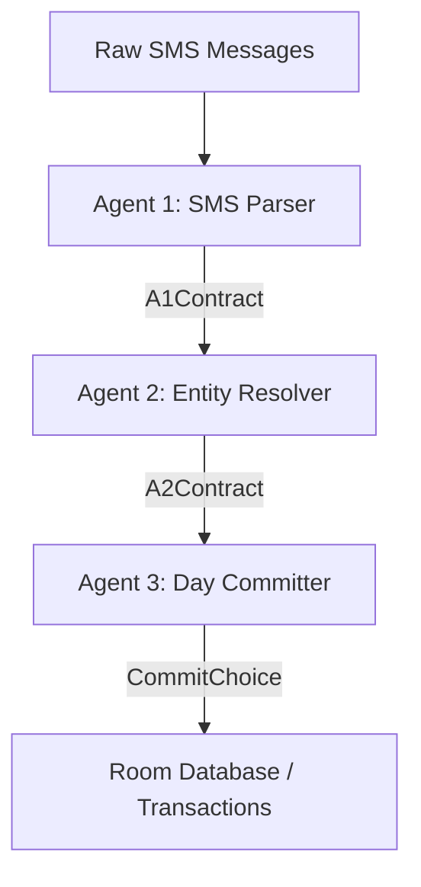

# SpendAI Agent Architecture

SpendAI is a local-first, on-device financial SMS parser and transaction tracking application. To process financial messages, the pipeline delegates to an agent-based parsing and grounding system.

## The Ingestion Pipeline

When SMS messages are received or ingested, they pass through [IngestionPipeline.kt](file:///home/deep/Documents/spendai/app/src/main/java/com/spendai/app/domain/ingestion/IngestionPipeline.kt). This pipeline groups messages by day and processes them sequentially using three specialized agents:

### 1. Agent 1: SMS Parser ([Agent1SmsParser.kt](file:///home/deep/Documents/spendai/app/src/main/java/com/spendai/app/domain/agent/Agent1SmsParser.kt))
* **Responsibility**: Parses single raw SMS messages.
* **Function**: Uses the LLM to extract primary transaction attributes—such as amount, currency, merchant name, and transaction kind (credit, debit, or ignore for non-financial messages).
* **Output**: [A1Contract](file:///home/deep/Documents/spendai/app/src/main/java/com/spendai/app/domain/agent/A1Contract.kt).

### 2. Agent 2: Entity Resolver ([Agent2EntityResolver.kt](file:///home/deep/Documents/spendai/app/src/main/java/com/spendai/app/domain/agent/Agent2EntityResolver.kt))
* **Responsibility**: Grounds transaction details against the user's database.
* **Function**: Resolves the merchant and account names from Agent 1 to actual database records. If they exist in [MerchantRepository.kt](file:///home/deep/Documents/spendai/app/src/main/java/com/spendai/app/data/repository/MerchantRepository.kt) or [AccountRepository.kt](file:///home/deep/Documents/spendai/app/src/main/java/com/spendai/app/data/repository/AccountRepository.kt), it links them using their database primary keys.
* **Output**: [A2Contract](file:///home/deep/Documents/spendai/app/src/main/java/com/spendai/app/domain/agent/A2Contract.kt) (containing resolved entities and keeping track of `parsedSmsId` and `rawSmsId`).

### 3. Agent 3: Day Committer ([Agent3DayCommitter.kt](file:///home/deep/Documents/spendai/app/src/main/java/com/spendai/app/domain/agent/Agent3DayCommitter.kt))
* **Responsibility**: Commits a unified daily ledger.
* **Function**: Examines the entire batch of resolved transactions for a given day. It makes final commit decisions (commit directly, hold for manual user review, or discard duplicates) to avoid importing erroneous data.
* **Safety Mechanism**: It maps returned choice indices back to verified database IDs (`rawSmsId`, `parsedSmsId`, `accountId`, `merchantId`) from Agent 2, preventing foreign key constraint violations from hallucinated IDs.

---

## Execution Strategies

Ingestion is executed in two environments:
1. **Periodic Background Syncs ([DailyParsingWorker.kt](file:///home/deep/Documents/spendai/app/src/main/java/com/spendai/app/worker/DailyParsingWorker.kt))**:
   * Uses Android's **WorkManager** framework to run periodic (24h) and one-shot (immediate on SMS receipt) tasks.
   * WorkManager holds a CPU WakeLock during execution, preventing the device from sleeping.
2. **Foreground Manual Ingestion ([IngestionService.kt](file:///home/deep/Documents/spendai/app/src/main/java/com/spendai/app/service/IngestionService.kt))**:
   * Runs as a foreground service with type `ServiceInfo.FOREGROUND_SERVICE_TYPE_DATA_SYNC`.
   * Acquires a partial CPU `WakeLock` from `PowerManager` to prevent CPU sleep (Doze) when the user turns off the screen.

---

## Inference Configuration ([GemmaInferenceEngine.kt](file:///home/deep/Documents/spendai/app/src/main/java/com/spendai/app/inference/GemmaInferenceEngine.kt))

Due to local hardware JNI constraints and token speed limitations, the engine delegates to the Gemini API (`gemma-4-31b-it`).

### Key Reliability Configurations:
* **JSON Thought Filtering**: Filters out candidate parts labeled `"thought": true` from the reasoning model's response structure before parsing the final JSON output.
* **Rate Limit Backoff**: Automatically intercepts `429` (Rate Limit) and `503` (Service Unavailable) status codes, waiting **60 seconds** before retrying.
* **Extended Timeouts**: OkHttpClient connection, read, and write timeouts are configured to:
  * Connection Timeout: **120 seconds**
  * Read Timeout: **300 seconds** (5 minutes to wait for complete reasoning paths)
  * Write Timeout: **120 seconds**
