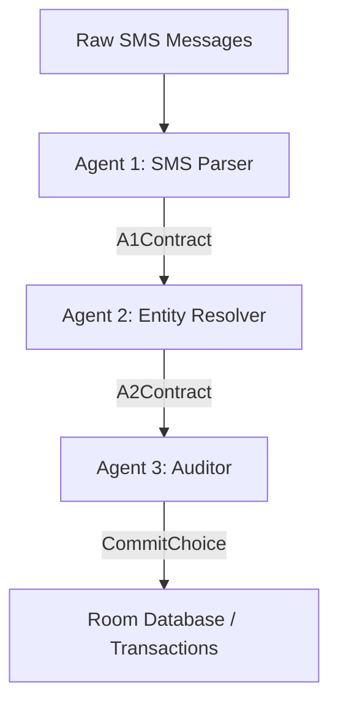
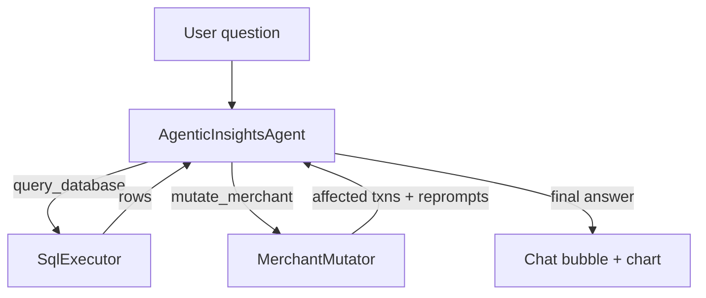

# SpendAI Agent Architecture

SpendAI is a local-first, on-device financial SMS parser and transaction tracking application. To process financial messages, the pipeline delegates to an agent-based parsing and grounding system. A second agentic flow ("Ask AI" on the Insights screen) gives the user a multi-turn chat over the same database with two tools: read-only SQL queries and allowlisted merchant-metadata writes.

## The Ingestion Pipeline

When SMS messages are received or ingested, they pass through [IngestionPipeline.kt](app/src/main/java/com/spendai/app/domain/ingestion/IngestionPipeline.kt). The pipeline processes messages sequentially using three specialised agents:

### 1. Agent 1: SMS Parser ([Agent1SmsParser.kt](app/src/main/java/com/spendai/app/domain/agent/Agent1SmsParser.kt))
* **Responsibility**: Parses single raw SMS messages.
* **Function**: Uses the LLM to extract primary transaction attributes — amount, currency, merchant name, channel, reference number, and transaction kind (`TRANSACTION` or `IGNORE`).
* **Output**: [A1Contract](app/src/main/java/com/spendai/app/domain/agent/A1Contract.kt).

### 2. Agent 2: Entity Resolver ([Agent2EntityResolver.kt](app/src/main/java/com/spendai/app/domain/agent/Agent2EntityResolver.kt))
* **Responsibility**: Grounds transaction details against the user's database.
* **Function**: Resolves the merchant and account names from Agent 1 to actual database records. The prompt bundle ships a slice of the merchant table (capped at 100) along with each row's `isSelf` flag and metadata (NOTE / CATEGORY_HINT / LABEL entries). A2 returns `merchant.kind = "none"` for any counterparty marked `isSelf = true` so future SMS stop being mis-parsed. A2's `materialiseMerchant` is also responsible for upserting metadata when the model emits it.
* **Output**: [A2Contract](app/src/main/java/com/spendai/app/domain/agent/A2Contract.kt) (containing resolved entities and keeping track of `parsedSmsId` and `rawSmsId`).

### 3. Agent 3: Auditor ([Agent3Auditor.kt](app/src/main/java/com/spendai/app/domain/agent/Agent3Auditor.kt))
* **Responsibility**: Audits the candidate transaction against recent activity and commits the final ledger.
* **Function**: Loads the 20 closest recent transactions (including their raw SMS text) and asks the LLM to deduplicate (Swiggy confirmation + bank debit = one transaction), link transfers / refunds (`SELF_TRANSFER` / `REFUND_OF` / `REVERSAL_OF` / `SPLIT_OF`), and correct A1/A2 mistakes (wrong direction, merchant, category, title, reference number). The auditor can also delete or modify previously-committed rows by id.
* **Safety Mechanism**: A2 returns row IDs (not model-chosen); the auditor only ever links / modifies / deletes rows that exist. The `modifications` block in the contract maps back to verified `rawSmsId` / `parsedSmsId` / `accountId` / `merchantId` from A2, preventing foreign key constraint violations from hallucinated IDs.

---

## Execution Strategies

Ingestion is executed in two environments:
1. **Periodic Background Syncs ([DailyParsingWorker.kt](app/src/main/java/com/spendai/app/worker/DailyParsingWorker.kt))**:
   * Uses Android's **WorkManager** framework to run periodic (24h) and one-shot (immediate on SMS receipt) tasks.
   * WorkManager holds a CPU WakeLock during execution, preventing the device from sleeping.
2. **Foreground Manual Ingestion ([IngestionService.kt](app/src/main/java/com/spendai/app/service/IngestionService.kt))**:
   * Runs as a foreground service with type `ServiceInfo.FOREGROUND_SERVICE_TYPE_DATA_SYNC`.
   * Acquires a partial CPU `WakeLock` from `PowerManager` to prevent CPU sleep (Doze) when the user turns off the screen.
   * Also drives the `ACTION_REPROMPT` flow (re-running A3 with a user-typed override prompt) and the durable `reprompt_job` table for cold-start resume after process death.

---

## Merchant Knowledge Layer

The user can teach the agents about counterparties in two ways that share the same `merchant` + `merchant_metadata` storage:

* **Manually** via the [MerchantsScreen.kt](app/src/main/java/com/spendai/app/ui/merchants/MerchantsScreen.kt) screen (home overflow → "Merchants"). Toggling `isSelf` and adding NOTE / CATEGORY_HINT / LABEL entries all flow through [MerchantMutator.kt](app/src/domain/agent/insights/MerchantMutator.kt), which is the same allowlisted write path the Ask-AI tool uses.
* **Conversationally** via the Ask-AI chat's `mutate_merchant` tool (see below).

### Schema (v8 → v9)
* `merchant.isSelf INTEGER NOT NULL DEFAULT 0` (indexed). The InsightsDao exclusion predicate drops every transaction whose merchant has `isSelf = 1` from KPIs, category breakdown, top merchants, daily trend, and day-of-week aggregates.
* New `merchant_metadata` table: `merchantId FK ON DELETE CASCADE`, `kind` enum (NOTE / CATEGORY_HINT / LABEL), `value` TEXT, `createdAt` INTEGER. Unique index on `(merchantId, kind)` so re-saving the same kind is an upsert.

When the user marks a merchant as `isSelf = true`, the mutator walks every transaction involving that merchant and:
1. For each transaction, finds the best transfer partner (opposite direction, similar amount within ±10%, within ±3 days, on a different account) and writes a `SELF_TRANSFER` row in `transaction_link` so the existing self-transfer exclusion in `InsightsDao` drops both sides from every aggregate.
2. Enqueues a durable `RepromptJob` per affected transaction (capped at 50 per call) so the IngestionService cold-start scan re-runs A3 with the new context injected.

---

## Ask AI (Agentic Insights Chat)

Reachable from the Insights screen header ("Ask AI"). A multi-turn chat with the on-device (or user-configured external) LLM that can do two things:

The orchestrator ([AgenticInsightsAgent.kt](app/src/main/java/com/spendai/app/domain/agent/insights/AgenticInsightsAgent.kt)) is a long-lived singleton that owns the conversation list, the system prompt, and the ReAct loop. Each turn:

1. Streams the model reply into an `AssistantMessage` (so the UI can show "thinking" in real time).
2. Parses the reply into one of three actions:
   * `query_database` — runs a single read-only SQL `SELECT` through [SqlExecutor.kt](app/src/domain/agent/insights/SqlExecutor.kt) (allowlisted tables, forced `LIMIT 200`, no `INSERT` / `UPDATE` / `DELETE`).
   * `mutate_merchant` — runs a parameterised mutation through [MerchantMutator.kt](app/src/domain/agent/insights/MerchantMutator.kt) (allowlisted to `merchant` + `merchant_metadata` only; can set `isSelf`, upsert/delete metadata; never touches `spend_transaction`).
   * `answer` — final reply with prose + optional inline charts.
3. Loops back: tool result is fed to the model on the next iteration.

### Verifier (off by default)

The orchestrator has a verifier toggle in the chat top bar (next to the bug-report icon). When **on**, after every `answer` the [AnswerVerifier.kt](app/src/domain/agent/insights/AnswerVerifier.kt) model-as-judge asks an independent pass to flag any specific claim in the answer that is not in the SQL rows. Up to `MAX_VERIFIER_ATTEMPTS = 3` re-prompts run before the orchestrator replaces the answer in place with "I could not produce a verified answer". When **off** (the default — the user said the re-prompt loop was getting in the way of quick chats), every answer is accepted on the first try.

### Parse-failure retries

Reasoning models (gpt-oss:120b, deepseek-r1, qwen3) occasionally emit a turn with no parseable action — a stray `<think>` block, a mid-stream timeout, a model that pre-plans multiple actions concatenated, or a string the model's own templating tried to fill in. The orchestrator's previous behaviour was to silently bail. The new behaviour:

* [AgentJsonParse.kt](app/src/main/java/com/spendai/app/domain/agent/AgentJsonParse.kt) now strips `<think>…</think>` (and `<thinking>…</thinking>`) blocks before scanning for JSON, then tries **every** balanced JSON object in the response. `tryParsePreferringAnswer` returns the LAST block whose `action` is `answer` so a reasoning model that pre-planned a tool call and an answer in one turn is honoured on its final intent.
* [AgenticInsightsAgent.kt](app/src/domain/agent/insights/AgenticInsightsAgent.kt) keeps a `parseFailureRetries` counter. On a turn that does not parse, it appends a `SystemMessage` asking the model to re-emit a clean JSON object (no `<think>` block, no template placeholders, no trailing prose) and continues the loop. After `MAX_PARSE_RETRIES = 2` retries it surfaces the raw stream and gives up the turn.

### System prompt

The full system prompt is in [AgenticInsightsSystemPrompt.kt](app/src/main/java/com/spendai/app/domain/agent/insights/AgenticInsightsSystemPrompt.kt). The key sections the model sees:

* **System context** — informs the model it's running inside SpendAI, single-user, INR, paise-denominated, small dataset, the user is non-technical, the model may be a small open-weights model.
* **Database schema** — every column documented, plus the self-transfer / self-merchant exclusion pattern (and the explicit "drop the filter if the user asks for self-transfers" hedge).
* **Tools** — `query_database` and `mutate_merchant` contracts, with hard rules (allowlisted tables, no write verbs, capped LIMIT, capped reprompt enqueue, etc.).
* **Output format** — `action` discriminator with three values, plus the explicit "do NOT emit `{{template}}` placeholders" rule.
* **Chart types** — `donut`, `bar_vertical`, `bar_horizontal`, `line`, each with the exact JSON shape.
* **Behavioural rules** — currency, self-transfers (defaulted to off but the user can override), paise vs rupees, time math, empty-result handling, anti-hallucination, refusals, privacy, brevity.
* **Worked examples** — three example turns the model can pattern-match against.

---

## Inference Configuration ([GemmaInferenceEngine.kt](app/src/main/java/com/spendai/app/inference/GemmaInferenceEngine.kt))

The engine supports five backends selected from the in-app Model settings screen: **Gemini** (default, `gemma-4-31b-it` over the Gemini API), **OpenAI-compatible** (gpt-oss, qwen, llama, deepseek), **Anthropic**, **ZHIPU**, and **Custom**. The user supplies the API key + base URL + model name in Model settings; nothing is hard-coded.

### Key Reliability Configurations:
* **JSON Thought Filtering**: Filters out candidate parts labeled `"thought": true` from reasoning-model responses that use the Gemini-style parts structure before parsing the final JSON output.
* **Rate Limit Backoff**: Automatically intercepts `429` (Rate Limit) and `503` (Service Unavailable) status codes, waiting **60 seconds** before retrying.
* **Extended Timeouts**: OkHttpClient connection, read, and write timeouts are configured to:
  * Connection Timeout: **120 seconds**
  * Read Timeout: **300 seconds** (5 minutes to wait for complete reasoning paths)
  * Write Timeout: **120 seconds**
