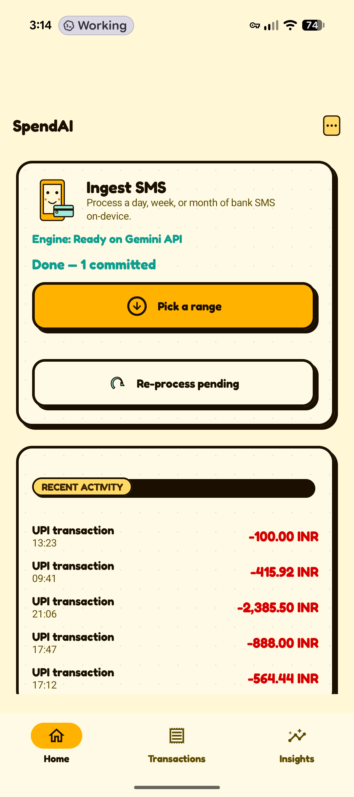
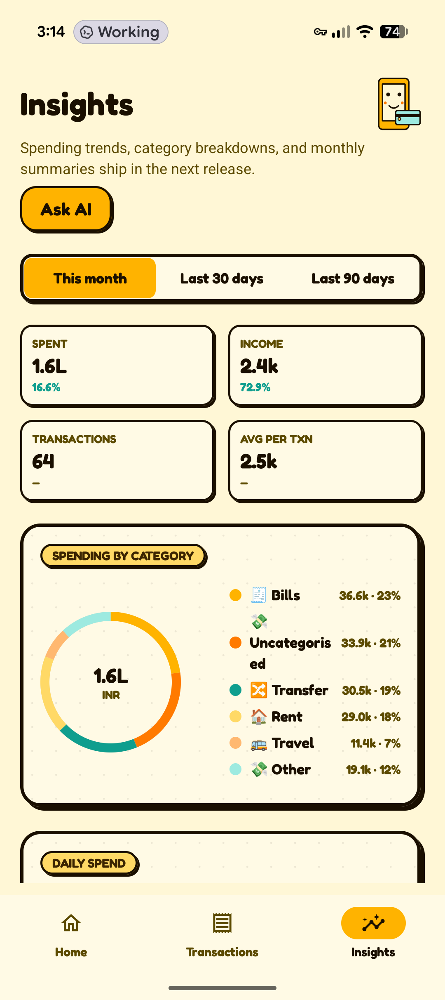
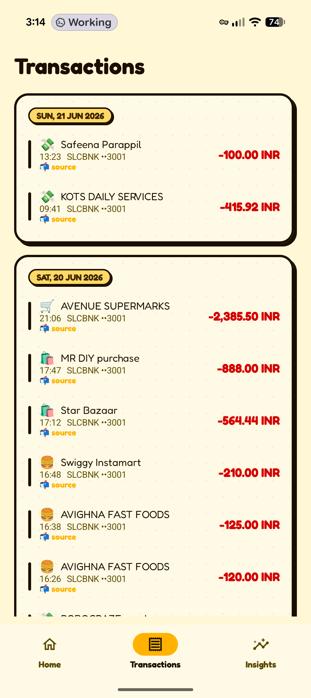

<p align="center">
  
</p>

<h1 align="center">SpendAI</h1>

<p align="center">
  Private, on-device expense tracking for Android.<br>
  Financial SMS in &rarr; a three-agent LLM pipeline &rarr; structured ledger + an "Ask AI" chat over your spending.
</p>

<p align="center">
  <a href="../../actions/workflows/build.yml"></a>
  <a href="LICENSE"></a>
  <a href="#"></a>
  <a href="#"></a>
</p>

---

## What is SpendAI?

SpendAI is a local-first Android app that turns the financial SMS messages you already receive into a structured, queryable spending ledger &mdash; without sending your messages off the device. A three-agent LLM pipeline (Parser &rarr; Entity Resolver &rarr; Auditor) ingests each SMS, deduplicates against recent activity, and writes clean transactions to an on-device Room database. An "Ask AI" chat then lets you ask natural-language questions over that ledger, with the model doing read-only SQL plus an allowlisted merchant-knowledge write tool.

Everything runs against an LLM API **you** configure in-app &mdash; Gemini, OpenAI-compatible, Anthropic, ZHIPU, or a Custom endpoint. No backend, no telemetry, no key hard-coding.

## Screenshots

<p align="center">
  
  
  
</p>

<p align="center"><sub>Home &nbsp;|&nbsp; Insights &nbsp;|&nbsp; Transactions</sub></p>

## Highlights

- **Three-agent SMS pipeline.** A1 parses raw messages, A2 grounds merchants and accounts against your database, A3 audits against recent activity to dedupe, link transfers and refunds, and correct mistakes.
- **On-device ledger.** All transactions, merchants, and metadata live in Room. The only network calls are to the LLM endpoint you choose.
- **Hand-rolled Insights UI.** KPIs, category donut, daily trend, top merchants, and day-of-week aggregates &mdash; all drawn with Jetpack Compose Canvas, no charting library.
- **Ask AI chat.** Multi-turn conversation with a ReAct loop over two tools: read-only SQL (allowlisted tables, capped `LIMIT`, no writes) and a merchant-knowledge mutator. Reasoning-model friendly: strips `<think>` blocks, retries parse failures, optional model-as-judge verifier.
- **Merchant knowledge layer.** Mark counterparties as "me", add notes and category hints &mdash; either in the Merchants screen or conversationally. Changes trigger durable A3 reprompts so the auditor's view stays fresh.
- **Full audit trail.** Edit, Review, and Debug log screens let you see exactly what the agents decided and correct it.

## Quick start

Requirements: **JDK 17** and the **Android SDK** with platform 35 + build-tools 35.0.0. Runs on Android 8.0 (API 26) and newer.

```sh
git clone https://github.com/deep-gaurav/spendai.git
cd spendai
./gradlew :app:assembleDebug
adb install -r app/build/outputs/apk/debug/app-debug.apk
```

> **Heads up on Play Protect.** Because SpendAI asks for `RECEIVE_SMS` and `READ_SMS` (Android classifies these as dangerous permissions), Google Play Protect may block the install with a "blocked by Play Protect" dialog. You can either build the APK yourself from this repo, or temporarily disable Play Protect in Play Store settings and re-enable after the install.

On first launch the onboarding flow walks you through SMS permissions and Model setup. After that SpendAI starts ingesting incoming financial SMS automatically, with a one-tap "Re-process pending" in the Debug log for past messages.

## How it works

```
SMS -> A1 (parse) -> A2 (resolve + isSelf/metadata) -> A3 (audit + link) -> Room: spend_transaction
                                                                       |
                                                                       v
Ask AI chat ---------------- read-only SQL ----------------------------+
mutate_merchant ----------- MerchantMutator -> merchant / merchant_metadata + reprompt_job
```

- **A1 &mdash; SMS Parser.** Extracts amount, currency, merchant, channel, reference, and transaction kind from a single message.
- **A2 &mdash; Entity Resolver.** Maps parsed merchant and account strings to database rows, applies the user's "this is me" flags, and materialises merchant metadata.
- **A3 &mdash; Auditor.** Loads the 20 closest recent transactions (with their raw SMS), then deduplicates, links transfers and refunds, and corrects mistakes before committing.

Release builds are signed via repository secrets when configured; the debug variant is always installable from a clean clone. Full design notes &mdash; agent prompts, contracts, the Ask-AI tool surface, the verifier &mdash; live in [AGENTS.md](AGENTS.md).

## Configuration

SpendAI delegates to an LLM API you supply. Open **Model settings** in the app and pick a backend:

- **Gemini** (default; works with the Google AI Studio free tier)
- **OpenAI-compatible** (gpt-oss, qwen, llama, deepseek via Ollama / LM Studio / OpenRouter)
- **Anthropic**, **ZHIPU**, or a **Custom** endpoint

Paste your API key (and base URL + model name where required) and tap **Probe** to round-trip a request and confirm the connection before saving. A 32K+ context window is recommended for daily ledger grouping. None of the backends or keys are hard-coded.

## Permissions

`RECEIVE_SMS`, `READ_SMS`, and `POST_NOTIFICATIONS` are runtime-permission gated. Onboarding walks you through consent before the rest of the app unlocks; you can revoke any of these later in system settings and the app keeps working with whatever remains.

## Tech stack

- **Kotlin 2.3** + **Jetpack Compose** (Material 3, hand-rolled Canvas charts)
- **Room 2.8** with KSP-generated DAOs and versioned schemas
- **WorkManager** for periodic ingestion (24h) and one-shot SMS-receipt triggers
- **LiteRT-LM** (`com.google.ai.edge.litertlm`) as the LLM runtime shim, with **Play Services TFLite** GPU dispatch
- **OkHttp** for the in-app model downloader and LLM API calls
- **Kotlinx Serialization** + **kotlinx.coroutines**

## Contributing

Issues and pull requests are welcome. For substantial changes, open an issue first to align on the design &mdash; the agent prompts and contracts in [AGENTS.md](AGENTS.md) are the source of truth for the parsing pipeline and the Ask-AI tool surface.

Before opening a PR:

```sh
./gradlew :app:lint
./gradlew :app:test
```

## License

[GNU General Public License v3.0](LICENSE).

## Acknowledgments

- The three-agent design and Ask-AI ReAct loop are inspired by Google's AI Edge Gallery.
- LiteRT-LM, Play Services TFLite, and the broader AndroidX / Jetpack libraries.
- Every dependency listed in [`gradle/libs.versions.toml`](gradle/libs.versions.toml) and the maintainers who keep them running.
